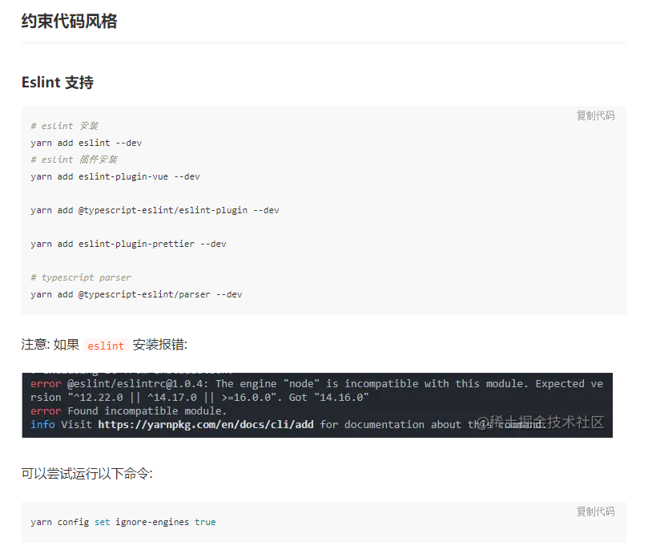
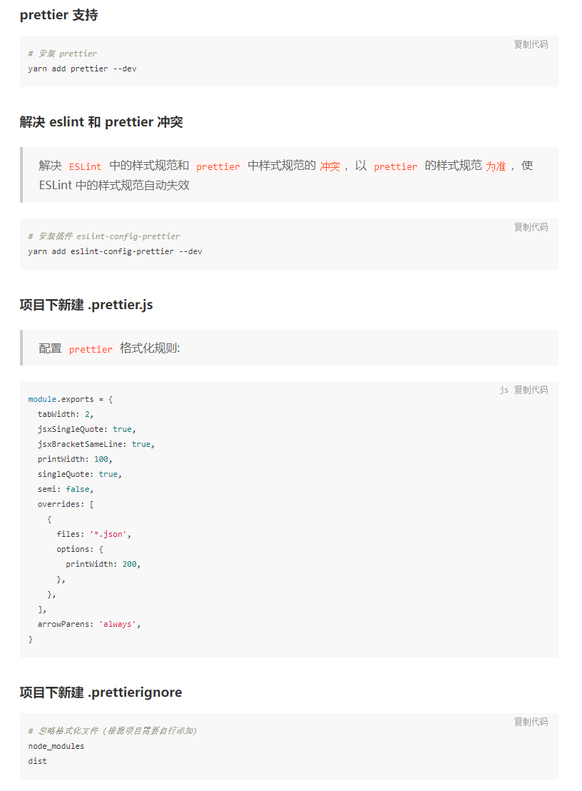

# 电力保供技术支持平台

## 推荐 IDE Setup

- [VSCode](https://code.visualstudio.com/) + [Volar](https://marketplace.visualstudio.com/items?itemName=johnsoncodehk.volar)

## 简介

基于 Vue3 + Typescript + ElementPlus 开发项目

## 特性

- **🌟 最新技术栈**：使用 Vue3/vite2 等前端前沿技术开发
- **🌟TypeScript**: 应用程序级 JavaScript 的语言
- **🌟sctipt setup**: 是在单文件组件 (SFC) 中使用组合式 API 的编译时语法糖
- **🌟unplugin-vue-macros**: 一个 Vue3 的宏插件，可以让你在 SFC 中使用宏

## 安装使用


- 安装依赖

```bash
# 安装 pnpm, 高效的包管理工具
npm install -g pnpm
```

```bash
pnpm install
```

- 运行

```bash
pnpm dev
```

- 打包

```bash
pnpm build
```

## 约束代码风格
>   eslint-config-prettier 会关闭ESLint中有关代码格式化的配置

>  eslint-plugin-prettier 把Prettier配置成ESLint的一个插件，让其当做一个linter规则来运行




> 参考[https://juejin.cn/post/7036745610954801166](https://juejin.cn/post/7036745610954801166)

> 一个 Vue 请求库[https://www.attojs.com/](https://www.attojs.com/)

## 浏览器支持

本地开发推荐使用`Chrome 80+` 浏览器

支持现代浏览器, 不支持 IE

| [](http://godban.github.io/browsers-support-badges/)</br>IE | [](http://godban.github.io/browsers-support-badges/)</br>Edge | [](http://godban.github.io/browsers-support-badges/)</br>Firefox | [](http://godban.github.io/browsers-support-badges/)</br>Chrome | [](http://godban.github.io/browsers-support-badges/)</br>Safari |
| :--------------------------------------------------------------------------------------------------------------------------------------------------------------------------------------------------: | :----------------------------------------------------------------------------------------------------------------------------------------------------------------------------------------------------: | :---------------------------------------------------------------------------------------------------------------------------------------------------------------------------------------------------------------: | :-----------------------------------------------------------------------------------------------------------------------------------------------------------------------------------------------------------: | :-----------------------------------------------------------------------------------------------------------------------------------------------------------------------------------------------------------: |
|                                                                                             not support                                                                                              |                                                                                            last 2 versions                                                                                             |                                                                                                  last 2 versions                                                                                                  |                                                                                                last 2 versions                                                                                                |                                                                                                last 2 versions                                                                                                |
